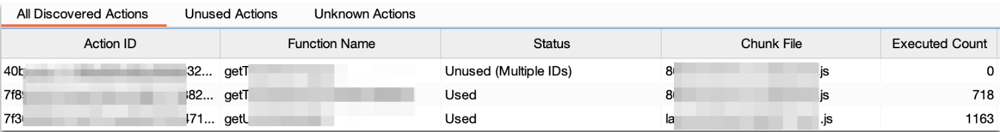

# Next.js Server Actions Analyzer for Burp Suite

A Burp Suite extension for analyzing Next.js Server Actions - server-side functions identified by hash IDs and `Next-Action` headers.

## Features

- **Auto-detection**: Captures Server Actions from proxy history or live browsing
- **Function mapping**: Extracts actual function names from JavaScript chunks  
- **Security analysis**: Identifies missing auth, sensitive parameters, errors, and IDORs
- **Unused action discovery**: Finds actions defined but never executed (by function name)
- **Testing tools**: Send to Repeater/Intruder with auto-marked parameters
- **Export**: Save analysis with customizable options (JSON format)

## Installation

1. Download `nextjs_actions.py`
2. Burp Suite → Extender → Extensions → Add
3. Select Python file (requires Jython 2.7+)

## Usage

1. **Scan Proxy History** - Analyzes requests and auto-discovers all actions
2. **Browse the app** - Captures new Server Actions in real-time
3. **Review actions** - Check the Action Discovery tab for unused actions
4. **Test & Export** - Use Repeater/Intruder for testing

## Interface

## Requirements

- Burp Suite Professional or Community
- Jython 2.7+ configured
- Target use Next.js Server Actions and probably have `productionBrowserSourceMaps` enabled

## License

For authorized security testing only. Ensure permission before testing.